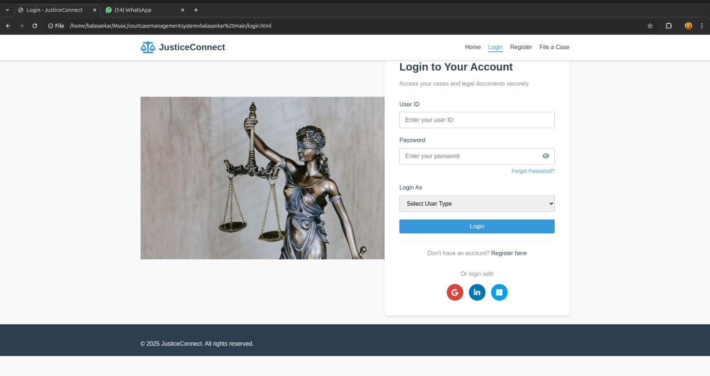
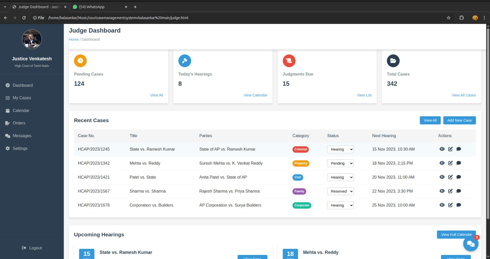
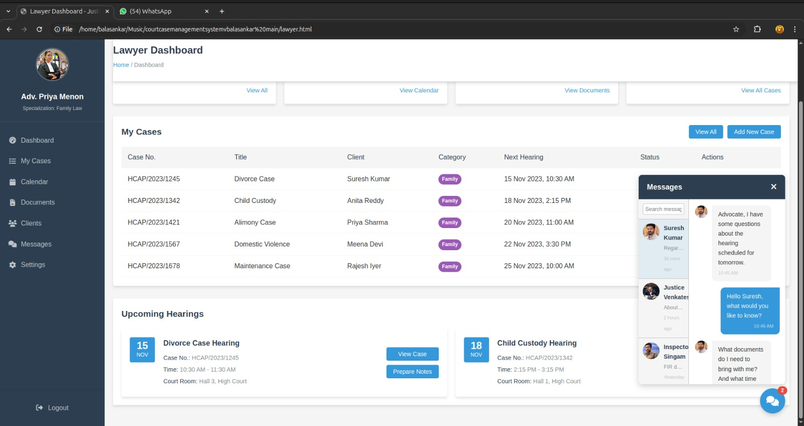
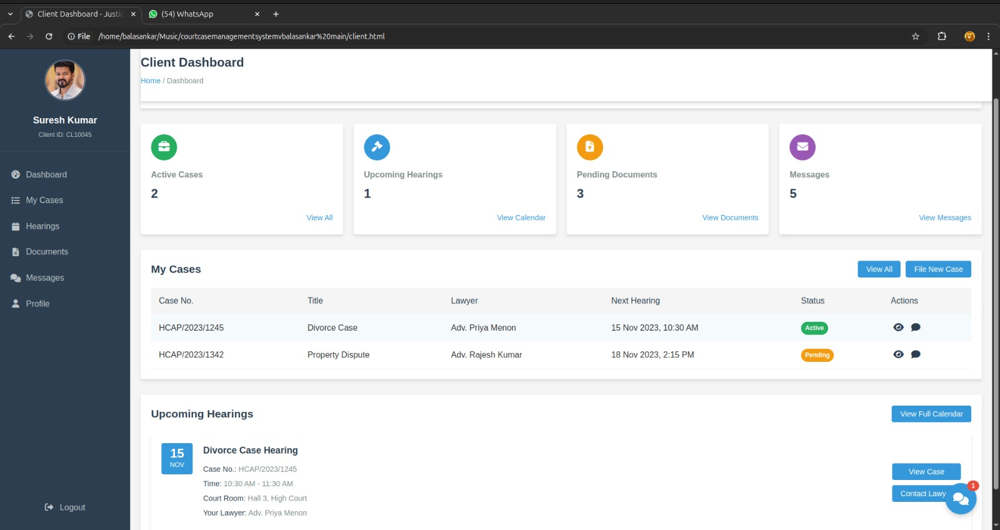

# Court Case Management System

This is a simple front-end prototype for a **Court Case Management System**, developed as part of the **CSI1007: Software Engineering Principles** course.

##  Project Overview

The system simulates a court case dashboard that can display total, pending, and closed cases. It includes a login page and a main dashboard interface. This version is built entirely with HTML, CSS, and JavaScript (no backend).

##  Features

- **Login Page** (index.html)
- **Dashboard UI** (dashboard.html) with:
  - Total Cases
  - Pending Cases
  - Closed Cases
- Responsive layout using CSS Flexbox
- Dynamic date and time display
- Basic JavaScript logic to simulate interactivity

##  How to Run

1. Download or clone the repository.
2. Open `index.html` in your web browser.
3. Use the login page to simulate logging in.
4. You’ll be taken to the dashboard page.

> Note: This is a static project; no backend or database integration is included.

##  Tools Used

- HTML5
- CSS3
- JavaScript (ES6)
- Code::Blocks (for other project modules)
- Windows Command Prompt

## 📷 Screenshots

### 🔐 Login Page

### ⚖️ Judge Dashboard

### 👨‍💼 Lawyer Dashboard

### 👤 Client Dashboard

## 👥 Team

- Prithiga(Author)
- Advikka
- Muthu piranitha
- Bala sankar

## 📄 License

This project is for academic use only and not intended for commercial distribution.
